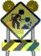

# ok\_image

# Unit ok\_image

- [Description](#PasDoc-Description)
- Uses
- Classes, Interfaces, Objects and Records
- Functions and Procedures
- Types
- [Constants](#PasDoc-Constants)
- Variables

## Description
This is @image tag test.

Note that for dvi, eps image will be chosen (for pdf and html, jpg):

Note that using the same image for the 2nd time will cause the same image to be included in the output (i.e. in the output we have *one* copy of ok\_image\_picture.jpg, not *two*).

Now note that pdf format will choose pdf version of the image:

## Overview

### Constants

<table>
<tr>

<td>

<code><strong><a href="ok_image.md#Unimportant">Unimportant</a></strong> = 0;</code>
</td>
</tr>
</table>

## Description

### Constants

<table>
<tr>

<td>

<code><strong>Unimportant</strong> = 0;</code>
</td>
</tr>
<tr><td colspan="1">

This item has no description.

</td></tr>
</table>
